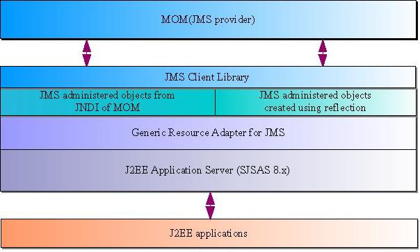
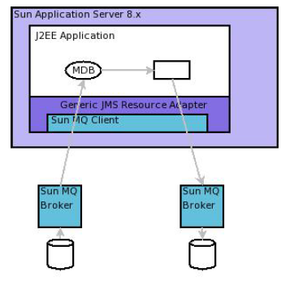
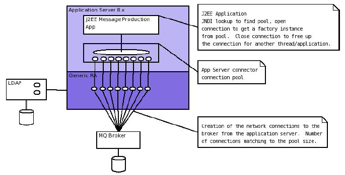
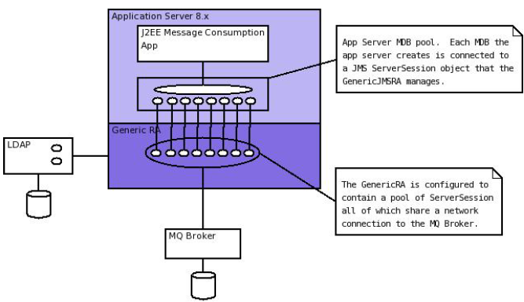

# Cookbook for connecting to JMS queues from Sun Application Server 8.x via the GenericJMSRA

Author:

```
Donald Forbes
```
Document Date:

```
1 June 2006
```

## Introduction

In order to consume and produce messages from a JMS provider via a J2EE application server there are many steps
required to setup the environment and many configuration options to be considered. These options make the
environment very flexible but are very confusing to a novice, the cookbook is not a prescriptive recipe to setup the
application server and JMS adapter but provides some guidance around the possible options and explains some
potential pitfalls that must be considered.

## Solution Overview

### Business Goals, Objectives & Purpose

This document explains the configuration options that are available to a deployer when setting up J2EE applications that will consume from and produce to queues via the Generic JMS Resource Adapter.


## Architecture Specification

### Overview

The Sun Message Queue product enables asynchronous message delivery that conforms to the Java Messaging Specification (JMS) 1.1. Messages can be placed onto a queue from within an application server which does so by using a resource adapter that has been specifically developed to connect the Sun Application Server 8.x to any JMS compliant resource. The adapter is known as the GenericJMSRA. At a high level Figure 1 depicts the architecture used to communicate from a J2EE application to the queuing system.



```
Figure 1 : Access Message Queue From J2EE application Via Generic JMS Resource Adapter
```
### Technical Architecture

This document explains the mechanism used for both the production and consumption of messages from within a J2EE application running in the Sun application server 8.x. The flow of messages considered is depicted in Figure 2 where a J2EE application will consume messages from a queue and then subsequently produce messages onto another queue. Description of the configuration is fairly independent of this flow but applies, independently, to the configuration required to produce messages and consume these messages.


```
Figure 2 : Application Architecture for message
consumption and production
```
#### Generic JMS Resource Adapter Configuration

The Generic JMS Resource Adapter (genericjmsra) is a resource adapter that adheres to the connector architecture 1.5. The Connector Architecture provides a standard contract to allow bi-directional connectivity between J2EE applications and Enterprise Information Systems (EIS) which allows for enterprise application integration (EAI).

The genericjmsra is deployed into the application server so that its connectivity functionality to any JMS provider is available to the applications deployed in the same server. The genericjmsra is deployed in the standard manner for any J2EE resource archive. i.e. It is shipped as a “rar” file that is deployed into the application server. When it is deployed there are a number of configuration options that can define its behaviour. In this document it is assumed that all the JMS administered objects will be sourced from a directory server.

Prior to deploying the RA it is recommended to setup a thread pool for it to use. The thread pool protects the rest of the application server from becoming unresponsive should the adapter or EIS system it is connecting to behave incorrectly. This pool must be large enough to handle the expected demand while still small enough to not to demand unnecessary system resource.

Having setup the thread pool the RA can now be deployed and configured to use the thread pool. The GUI does this in a single step where all the configuration is specified and the asadmin command line first uses the `create-resource-adapter-config` command to define the parameters then the `deploy` command to actually deploy the RA into the application server.

The available parameters that are pertinent to the RA accessing JMS administered objects via LDAP are:-

.Generic JMS RA deployment parameters
[options="header"]
|==================================
|Config
Parameter|Description|Default
Value|Example (To deploy using admin
objects in a directory server)

|ProviderIntegrationMode|Defines if the administered objects
are beans with all configuration
described in the AS configuration or
if the objects are to be retrieved
from an object store.||Jndi
|JndiProperties|
Gives all the properties required to
tell the RA where to look up the
object store. Only required if the
ProviderIntegrationMode is
jndi.||
java.naming.factory.initial=com.sun.j
ndi.ldap.LdapCtxFactory,java.naming
.provider.url=ldap://tannoch:389/ou=c
onfigs%2cdc=uk%2cdc=sun%2cdc=c
om,java.naming.security.principal=cn
=Directory
|SupportsXA|Defines if the resources that the
genericjmsra connects to are to
partake in an XA transaction.
|False|True
|UserName|Defines the username used to
connect to the directory server||Admin
|Password|Defines the password used to
connect to the directory server.||Admin
|LogLevel|Determines the level of logging that
the genericra will output to the
application server's log file.
Valid values – FINEST, FINER,
FINE, INFO, WARNING, SEVERE|INFO|INFO
|==================================

Note:- Connecting to different parts of the LDAP tree via a single deployed Generic RA

When deploying the rar file properties are defined, these can be overridden either in the activation specification of a message driven bean (MDB) or in the properties of the connection resources. A bug (6418484) has been identified in Application Server 8.1 which results an overridden value for any of the properties in the pools is not being honoured. (According to the connector specification all javabean properties must be honoured.) As such if there are several connection pools being set up for multiple administered objects held in the directory server and these have different paths then multiple rar files would have to be deployed, each with a different URL specified or all the administered objects can be held in the same LDAP tree.

Alternatively, by explicitly specifying the JndiProperties in the resource adapter deployment descriptor (ra.xml) then the contract is honoured and different LDAP paths can be defined in different connection pools/MDB activation configurations. 

i.e. Add the following xml snippet to the inbound and outbound configurations in the ra.xml.

```xml
<config-property>
    <config-property-name>JndiProperties</config-property-name>
    <config-property-type>java.lang.String</config-property-type>
    <config-property-value></config-property-value>
</config-property>
```

#### Application Server Configuration for Message Production

When a J2EE application wishes to produce messages onto a message queue the code will perform a lookup in the application servers JNDI space to discover the QueueConnectionFactory, open the connection create any necessary sessions then close down the session and connection objects it used.

The application server must be configured to pool connections created by the GenericRA to the message queue broker, when the application requests a factory object the application server gives a handle to the pool and the creation of the connection will return a factory instance to the application from the pool. When the application closes the connection the factory instance is returned to the pool when any transaction that is in progress completes.

From a code perspective the create... method on the connection object will take an object from the pool and a close method returns the object but only once any transaction that is active has completed. Thus code could look like:-

```java
try {
    createConnection // Books the connection out of the pool
    createSession
} catch( Exception e) { // Exception processing...
} finally {
    try {
        closeSession()
    } catch (Exception e) { //...
    }
    try {
        closeConnection() // Replaces the connection in the pool. (After transaction.)
    } catch (Exception e) { //...
    }
}
```

The setup is depicted in Figure 3, this shows that the application server will maintain a pool of
connections that are setup by the generic JMS resource adapter. A J2EE application can then make use of the pooled connections.


```
Figure 3: Pooling of connections for message production.
```
In order to configure this as a prerequisite the genericra must be deployed into the application server. The pool of QueueConnectionFactories can then be configured and the pool linked to the connector resource name that the application will lookup. i.e. Define the JNDI lookup name for locating the resource from a J2EE application.

Details on the configuration options for the application server pool settings are described in detail in the application server reference and administration guides. (Reference 2 & 3) However it is important to be aware of:-

1. Pool settings
  - The pool settings define the maximum number of concurrent threads that can produce messages so the minimum pool size should be set to be about the number of concurrent threads that are expected.
  - Each object in the pool results in two physical network connections being made to the broker (For Sun Message Queue) there is an overhead in stack memory for all the connections that are made which needs to be considered when setting the memory settings for the server.
  - The Max wait time defines the amount of time before a timeout is returned. When an application requests an object from the pool if the pool has no objects available then the request will hang until either an object becomes available or the max wait time is exceeded. Once the wait time has expired then a timeout exception is returned to the application, the applications must be coded to handle this in an appropriate manner.
2. Transaction support must be set to XATransaction if the resource is to participate in a two phase
commit with other resources. 
3. **Close All Connections**
  - A bug has been identified in AS8.1 (6411409) where with the close all connections being set to true can result in duplicate messages being produced to a queue in the event of the outbound queue being shutdown and restarted. This bug can be avoided by having Close All Connections set to **false**. Releases of the application server higher than 8.1 SP10 will not suffer from this issue.

##### Connector Pool Properties

Properties of the connector-connection-pool element are the names of setter methods of the
managedconnectionfactory-class element in the ra.xml file. Properties of this element override the
ManagedConnectionFactory JavaBean configuration settings. For the GenericJMSRA the
properties that can be overridden are:-

.Generic RA configurable parameters for connector pool
[options="header"]
|=========================
|Config Parameter|Description|Default
Value|Example
|ConnectionFactory
JndiName|This provides details of the actual entry of the managed object in
LDAP. The connection factory.
This can define the entire URL to
the directory entry or can be
relative to the URL defined in the
deployment of the genericjmsra.
||cn=theQueueConnectionFa
ctory
|ClientId|The purpose of the client identifier
is to associate a connection and its
objects with a state maintained on
behalf of the client by a provider.
By definition, the client state
identified by a client identifier can
be in use by only one client at a
time.||
|Connection
ValidationEnabled|This is a boolean that alters the
behaviour of the GenericRA to confirm the connection is still valid before using it. It is mandatory to have the setting set to *true* if the connections are to reconnect to a broker that has failed for any reason.|False |true
|=========================

#### Deployment Descriptors for Message Driven Bean (Message Consumption)

For message consumption through a Message Driven Bean the architecture used is depicted in Figure 4.
When an MDB based application starts up the app will request a pool of message driven beans from the
container, this request is passed on to the generic RA which will create a pool of JMS ServerSessions to
consume messages. All these sessions are physically connected via a single connection to the broker.
(two physical network connections)

When a Message Driven Bean is to consume messages from a queue via the GenericJMSRA it does so
by specifying use of the connector resource that was named when deploying the GenericJMSRA in the
sun-ejb-jar.xml deployment descriptor. This is done via the use of the resource-adapter-mid tag in
the deployment descriptor. (DD) If this has been defined then the activation config specifies all the
configuration necessary to connect the MDB to the queue and control the non-functional behaviour.

Because of the fact that there are two independent pools involved in the architecture of message
consumption through the genericJMSRA care must be taken to ensure that the two pools remain in sync.
The pools involved are:-

- MDB pool, defined by default in the AS configuration or overridden in the deployment descriptor
    for the MDB application.
- Generic RA pool of ServerSessions. This is defined in the activation config elements of the DD
    for the application.

The smaller of these two pools will define the maximum concurrency for message consumption. If the
MDB pool is smaller than the RA pool then the RA will have created excess ServerSessions that never
consume messages but simply use up some system resource. Conversly if the MDB pool is larger than
the pool of ServerSessions then excess MDBs will not get connected to a ServerSession and hence never
process messages.


```
Figure 4 : Message Consumption by Message Driven Beans (MDB)
```

JMS resources accessed through the generic RA can be used in an XA transaction with other resource
managers. As such there is the possibility that either a resource or the application server may fail during
the XA transaction lifecycle, in this case the application server can be used to recover transaction, either
committing or rolling back the transaction depending on the exact status at the point in time of the failure.
On startup of the server the application server will connect to all XA resources and interrogate them to
determine if any transactions need to be recovered. (rollback or commit) Message Driven Beans interact
directly with the deployed resource adapter via the activation specification in their deployment descriptor.
This means that the application server will not attempt to recover from the queue that a MDB is connected
to. To work around this ensure that a connection pool is configured that points at the same broker/queue
that the MDB consumes from.

##### MDB Deployment Descriptor Properties

.MDB Deployment Descriptor parameters
[options="header"]
|==================================
|Config Parameter|Description|Default Value|Example
|MaxPoolSize|Maximum size of server session
pool internally created by
resource adapter for achieving
concurrent message delivery.
This should be equal to
maximum pool size of MDB
objects.|8|32
|MaxWaitTime|Resource Adapter will wait for
the time in seconds specified by
this property to obtain a server
session from its internal pool. If
this limit is exceeded message
delivery will fail.|3|
|MessageSelect
or|A valid MessageSelector as
specified by jms 1.1 specification.||
MessageFormat =
'Version 3.4'
or
<![CDATA[
InventoryID
='S9387763-02' AND
Quantity BETWEEN 100
AND 1300
]]>
|ClientID|ClientID as specified by jms 1.1 specification.
||MdbConsumer
|ConnectionFac
toryJndiName|JNDI name of connection
factory created in JMS provider.
This connection factory will be
used by resource adapter to
create a connection to receive
messages. 
Used only if
ProviderIntegrationMode is
configured as “jndi”. The value
points at the lookup name in the
jndi store, thus if the
administered objects are held in
ldap then the value should be
cn=... || cn=myQueueConnectionFactory
|DestinationJn
diName|JNDI name of destination
created in JMS provider. This
destination will be used by
resource adapter to create a
connection to receive messages
from. Used only if
ProviderIntegrationMode is
configured as “jndi”. Syntax as
per connection factory lookup.||
cn=myDestinationQueue
|DestinationTy
pe|Type of the destination the MDB
will listen to.||javax.jms.Queue or javax.jms.Topic
|RedeliveryAttempts|Number of times a message will
be redelivered in case a
message cause a runtime
exception in the MDB.
Note – Some JMS providers
have this functionality built into
their product. Unless the code
want the poisoned messages to
be handled by the dead
message queue after a
redelivery, it is better to keep
the value set to zero. Otherwise,
the re-delivery of rolled back
messages and Redelivery of
genericjmsra might confuse
each other.||0
|==================================

### Application Server Transaction Configuration

There are a number of configuration options to control the behaviour of the transaction manager that is built into the application server. These options are configured in the specific configuration for the instance or cluster of instances that will be communicating with the JMS resources. The options for the transaction manager are described in Table 4.

.Application Server Transaction Manager configuration.
[options="header, header"]
|==================================
|Config Parameter|Description 1.2+|Default
Value 1.2+|Example|
^|GUI ^|Command Line|
|OnRestart|config-
name>.transaction-
service.automatic-
recovery|Determines if the application
server will automatically attempt
to recover transactions when it is
started.|true|
|Transaction Timeout
|config-
name>.transaction-
service.timeout-in-
seconds|By default,the server does not
timeout a transaction.That is,the
server waits indefinitely for a
transaction to complete. If you
set a timeout value for
transactions, if a transaction isn't
completed within the configured
time, the Application Server rolls
back the transaction.|0|
|Retry
Timeout|config-
name>.transaction-
service.retry-
timeout-in-seconds|Sets the amount of time (in
seconds) the Application Server
tries to connect to the
unreachable server in the Retry
Timeout field.|600|60
|Transaction Log
Location|config-
name>.transaction-
service.tx-log-dir|The transaction log records the
information about each
transaction in order to maintain
the data integrity of the
resources involved and to
recover from failures.
Transaction logs are kept in the
tx subdirectory of the directory
specified by the Transaction Log
Location. These logs are not
human readable.|${com.sun
.aas.instan
ceRoot}/lo
gs|/some/other/directory/if/the/d
efault/is/not/desired/log
|Heuristic
Decision|config-
name>.transaction-
service.heuristic-
decision|This can be set to rollback or
commit. If a transaction is in an
indeterminate state then the
action specified here is the
action that will be taken. i.e. By
default it will rollback all
operations.|rollback| 

|KeyPoint
Interval|config-
name>.transaction-
service.keypoint-
interval|Keypoint operations compress
the transaction log file. The
keypoint interval is the number
of transactions between keypoint
operations on the log. Keypoint
operations can reduce the size
of the transaction log files. A
larger number of keypoint
intervals (for example, 2048)
results in larger transaction log
files, but fewer keypoint
operations, and potentially better
performance. A smaller keypoint
interval (for example, 256)
results in smaller log files but
slightly reduced performance
due to the greater frequency of
keypoint operations.
Every transaction is written into
the tx log file and every n
transactions that occur the app
server will clean out the
transaction log file so that only
currently active transactions are
held there. The value of n is the
keypoint value. Thus a large
value will give larger files but
better performance as there are
less clean out operations while a
small value will give small files
but the clear down has to
happen more often. In either
case transactions that are in-
flight will always be kept.

Set the keypoint interval to as
large as possible a value if the
disk space is of not a concern. At
a key point, transaction log
system logs a special record
called "key point start" and then
tries to rewrite all the active
transactions. if they have been
written earlier and puts "keypoint
end" special record. Transaction
log system considers the rewrite
entries only if it finds a "key point
start" as well as "keypoint end"
records.|2048
|==================================

### Overlap between GenericJMSRA config and JMS Client/Broker Configuration 

A number of the configuration options that the genericjmsra can perform overlap with behaviour that can be configured either by the connection factories or by the broker it is connecting to. Only one object should take responsibility for this behaviour with the more centralised connection factories or broker taking control. The
configuration options in particular are detailed in

|===
|Configuration|GenericRA|ConnectionFactory|Description
|Redelivery|Value specified in the
activationSpecification
of an MDB.
Key Properties:-
RedeliveryAttempts
RedeliveryInterval
SendBadMessagesToDMD
|N/A |Number of times a message will be
redelivered in case a message causes a
runtime exception in the MDB. If the number
specified is exceeded then the message is
placed on the dead message destination
defined.
Generally more control is desired and the
client code determines what should be done
with a message that cannot be processed.
i.e. Set RedeliveryAttempts to 0
|Reconnection|Activation specification
properties for an MDB:-
`ReconnectAttempts
ReconnectInterval`

Connection pool
properties:-
`ConnectionValidationE
nabled`
This must work in
conjunction with the
application servers pool.
By specifying this option
then any exception is passed back to the
application server which
will destroy that pooled
object and recreate the
connection.
|The connection
factory is capable of
performing a
reconnect to the
broker by setting the
following
properties:-
Address List
Number of address
list iterations
Enable auto-
reconnect
Number of reconnect attempts
per address
Reconnect Interval

These properties
allow the connection
to be re-established
to all the possible
brokers defined for a
number of attempts.
See MQ
documentation for
details.
|Either option is viable to use however there
are advantages to using the genericjmsra
capabilities and app server config to control
reconnect logic.

For an MDB (inbound messages) reconnect
there will be a controlled soft shutdown of
current messages and cleanup of stale
connections/sessions. This is not possible
with the MQ reconnect logic.

For outbound connections the configuration
for the application server is preferred. If the connection validation fails then either a
successful reconnect will occur and the client
code continues or the reconnect fails and the
client is immediately informed. If MQ does the
reconnect then the pool will never become
stale but if the broker is down for an extended
period of time and the reconnect attempts is
exceeded then the pool can become full of
stale connections. Then the pool would have
to be configured to have a steady state size of
0 and the resizer would have to size the pool
down to 0 connections by the time that the
reconnect attempts expires.
|===


## Appendix

### Example Application Server Configuration Script Commands

The following asadmin commands can be used to configure the application server to deploy the GenericJMSRA
and configure the connection pools.
["header"]
|===
|Asadmin Command (Not showing options of – host, - -
port, - -user & - -passwordfile for clarity. Apply to all commands)|Description
|asadmin create-threadpool
--target <Configuration_name>
--maxthreadpoolsize <max_size>
--minthreadpoolsize <minimum size>
--idletimeout <time_in_seconds_for_timeout>
--workqueues <number_of_work_queues>
name_of_thread_pool
|This command will create a thread pool in a configuration. The genericjmsra can then be allocated to utilise this threadpool. Ensure that the number of threads in the pool will be enough to cope with the number of connections that the generic JMSRA will be expected to setup. (i.e. Number of objects in the pools and number of server sessions/MDBs that it will be expected to handle.)
|asadmin create-resource-adapter-config
--threadpools $THREAD_POOL_NAME
--property
SupportsXA=true:ProviderIntegrationMode=jndi:UserN
ame=<user_name_for_JMS>:Password=<jms_user_passwor
d>:JndiProperties=java.naming.factory.initial\\=co
m.sun.jndi.ldap.LdapCtxFactory,java.naming.provide
r.url\\="<url_for_direcory",java.naming.security.p
rincipal\\=<username_for_directory>,java.naming.se
curity.credentials\\=<userpassword_for_directory>:
LogLevel=info
name_of_resource_adapter_to_be_deployed
|
This command will setup the properties that will apply to
the deployment of the generic JMS RA. The properties
define the fact that it will:-
- Support XA transactions
- provide a username and password for connecting
    to the JMS broker
- Define the JNDI Properties that will be used to
    connect to the LDAP source. (URL,
    username/password etc.)
- Output log level for the adapter.
Other options link the adapter to the thread pool that was
previously created.
The name of the resource must match to the name that
will be given to the deployed adapter. (next step)
|asadmin deploy
--name <name_of_resource_adapter_to_be_deployed>
--target <cluster_name_or_instance_name>
/location/of/the/genericjmsra.rar_file
|This command will deploy the actual rar file to the server, using the configuration that was previously setup and defining the clusters/instances that it will be deployed to.
|asadmin create-connector-connection-pool
--steadypoolsize <expected_concurrency_value>
--maxpoolsize <max_concurrency_value>
--poolresize
<number_pooled_objects_removed_when_resizing>
--idletimeout <how_often_pool_resizes>
--raname <resourse_adapter_to_use>
--connectiondefinition
javax.jms.QueueConnectionFactory
--transactionsupport XATransaction
--property
ConnectionValidationEnabled=true:ConnectionFactory
JndiName=<for_ldap_URL_of_administered_object-
cn=...>
meaningful_name_for_connection_pool
|Creates the connection pool for all the connection
factories that provide the access to the JMS resource. The usual pooling configuration options are required.
The properties are extensions to the normal app server
pooling mechanism that are specific to the
GenericJMSRA. If the pool is to check the connection
prior to usage then the property
ConnectionValidationEnabled is required. The
ConnectionFactoryJNDIName is used to specify the actual
JMS administered object that is held in the directory
server.
|asadmin create-connector-resource 
--poolname <link_to_pool_to_use> 
--target <cluster_or_instancename>
jndi_name_that_apps_will_lookup
|This command will define the JNDI name that an
application will lookup to get access to the resource. The name is then linked to the connector pool and all the clusters/instances that the resource is to be available on are defined.
|asadmin create-admin-object
--raname <name_of_resource_adapter_deployed>
--target <cluster_or_instancename>
--restype javax.jms.Queue
--property
DestinationJndiName=<URL_for_location_of_destinati
on_in_directory>
jndi_lookupname_for_destination
|Defines the JNDI lookup name for an administered object. In the case of JMS this is the destination/queue name. The properties link the lookup to the resource adapter, type of the resource and the cluster/instances that will advertise the destination. The properties allow the URL for the lookup in ldap where the administered objects are stored.
|===
There may be a requirement to add additional properties to the application server to add to the classpath or a
need to modify the server.policy file for the security manager.

### Example MDB Deployment Descriptors

The following is an example of the sun-ejb.xml for an application that holds a message driven bean:-

```xml
<?xml version="1.0" encoding="UTF-8"?>
<!DOCTYPE sun-ejb-jar PUBLIC "-//Sun Microsystems, Inc.//DTD Application Server 8.1 EJB 2.1//EN"
"http://www.sun.com/software/appserver/dtds/sun-ejb-jar_2_1-1.dtd">
<sun-ejb-jar>
<enterprise-beans>
<name>MessageQueueMDBProcessingModule</name>
<ejb>
<ejb-name>QueueConsumerBean</ejb-name>
<jndi-name>jms/queue_destination_ra</jndi-name>
<ejb-ref>
<ejb-ref-name>ejb/PersistenceFacadeBean</ejb-ref-name>
<jndi-name>ejb/PersistenceFacadeBean</jndi-name>
</ejb-ref>
<mdb-connection-factory>
<jndi-name>jms/queue_connection_factory_ra</jndi-name>
</mdb-connection-factory>
<mdb-resource-adapter>
<resource-adapter-mid>mq_resource_adapter</resource-adapter-mid>
<activation-config>
<activation-config-property>
<activation-config-property-name>DestinationType</activation-config-property-name>
<activation-config-property-value>javax.jms.Queue</activation-config-property-value>
</activation-config-property>
<activation-config-property>
<activation-config-property-name>MaxPoolSize</activation-config-property-name>
<activation-config-property-value>32</activation-config-property-value>
</activation-config-property>
<activation-config-property>
<activation-config-property-name>RedeliveryAttempts</activation-config-property-name>
<activation-config-property-value>0</activation-config-property-value>
</activation-config-property>
<activation-config-property>
<activation-config-property-name>ReconnectAttempts</activation-config-property-name>
<activation-config-property-value>4</activation-config-property-value>
</activation-config-property>
<activation-config-property>
<activation-config-property-name>ReconnectInterval</activation-config-property-name>
<activation-config-property-value>10</activation-config-property-value>
</activation-config-property>
<activation-config-property>
<activation-config-property-name>RedeliveryInterval</activation-config-property-name>
<activation-config-property-value>1</activation-config-property-value>
</activation-config-property>
<activation-config-property>
<activation-config-property-name>ConnectionFactoryJndiName</activation-config-property-name>
<activation-config-property-value>cn=queue_connection_factory</activation-config-property-value>
</activation-config-property>
<activation-config-property>
<activation-config-property-name>DestinationJndiName</activation-config-property-name>
<activation-config-property-value>cn=queue_dest</activation-config-property-value>
</activation-config-property>
</activation-config>
</mdb-resource-adapter>
</ejb>
<cmp-resource>
<default-resource-principal>
<name>QueueConsumer</name>
</default-resource-principal>
</cmp-resource>
<message-destination>
<message-destination-name>QueueConsumerDestination</message-destination-name>
<jndi-name>jms/queue_destination_ra</jndi-name>
</message-destination>
</enterprise-beans>
</sun-ejb-jar>
```
