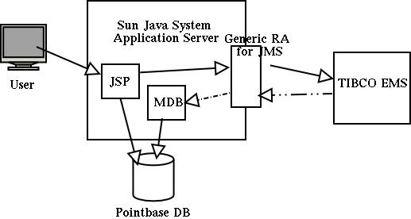

# Integrating Sun Java System Application Server with Tibco EMS using the Generic Resource Adapter for JMS

:author: Narayanan.V, Sivakumar Thyagarajan, Binod PG.
:version: 0.9
:description: This document provides step-by-step instructions on how to use the Generic Resource Adapter for JMS to integrate Tibco EMS with Sun Java System Application Server.

This document serves as a guide to configuring a sample application to work with the Tibco JMS provider, using the Generic Resource Adapter for JMS as an integration mechanism between the application server and the message provider. The sample application discussed in this document leverages both inbound and outbound communication to the JMS provider enabled by the resource adapter and also simulates distributed transactions [XA] in an MDB by persisting messages to a relational database. 

## Sample Application

An application client, supplies order details to a session bean deployed in the application server. The session bean sends these order details to a queue, using the outbound capabilities provided by the Generic Resource Adapter. A Message Drive Bean, deployed in the application server and configured to use the Generic Resource Adapter to work with Tibco, asynchronously consumes messages from this queue, and processes the order. The CMT Message Driven Bean then persists the processed Order information to a relation datastore to simulate a distributed transaction.



The following steps describes how the Generic Resource adapter is deployed and configured in Sun Java System Application Server 8.1 2005Q1 UR1 to use Tibco EMS. Connector resources can be configured via both the asadmin GUI and CLI in SJSAS. This document, however uses the CLI to demonstrate all operations. 

The sample application is available off the main distribution under the samples/tibcosample directory. To configure the resource adapter and set up resources and deploy the sample application, use the ant  "deploy" target. The "undeploy" target available under the directory, would delete the resources and undeploy the sample application.

## Resource Adapter Deployment/Configuration

### Initial Setup

The following permissions need to be added to the server.policy and the client.policy file to deploy the generic resource adapter and to run the client application.

- Edit the server.policy file in the [${install}/domains/domain1/config/] directory and add the following line to it.

    permission java.util.logging.LoggingPermission "control";
                 
- In the event of using an application client, edit the client.policy file in the [${install}/lib/appclient/client.policy] directory and add the following line to it.

    permission javax.security.auth.PrivateCredentialPermission "javax.resource.spi.security.PasswordCredential * \"*\"","read";
    
- Copy the tibjms.jar and tibjmsapps.jar files that come with Tibco EMS to the [${appserver-install-dir}/domains/domain1/lib/classes] directory. Modify the domain's classpath to add these jars. The asadmin GUI could be used to modify a domain's classpath. Go to Application Server -> JVM Settings -> Path Settings . Add an entry in the classpath suffix for these jar files. Restart the domain for these changes to take effect.

### Configuring the Resource Adapter
Add ${appserver-install-dir}/bin to your PATH. The asadmin CLI command can be found at ${appserver-install-dir}/bin. In SJSAS, resource adapter configuration is done prior to its deployment. Use the following command to create a resource adapter configuration for genericra, to configure it to work with Tibco EMS.

```
asadmin create-resource-adapter-config --user <adminname> --password <admin password> --property SupportsXA=true:ProviderIntegrationMode=jndi:UserName=admin:Password=###:
JndiProperties=java.naming.factory.url.pkgs\\=com.tibco.tibjms.naming,java.naming.factory.initial\\=com.tibco.tibjms.naming.TibjmsInitialContextFactory,java.naming.provider.url\\=localhost\\:7222:LogLevel=finest genericra
```

A brief description of the various properties used in the above command is explained below:

`_SupportsXA_` Set the supports distributed transactions attribute to true. The level of transactional support the adapter provides -- none, local, or XA -- depends on the capabilities of the EIS being adapted. If an adapter supports XA transactions and this attribute is XA, the application can use distributed transactions to coordinate the EIS resource with JDBC and JMS resources.

`_ProviderIntegrationMode_`
Set the integration mode as JNDI. Two integration modes exist in the Generic Resource Adapter for JMS. The JNDI mode allows the resource adapter to use the administered objects published in the message provider's JNDI provider to integrate with the message provider.

`_Username_` and `_Password_`
Message provider specific user credentials. [In this case, modify this attribute to reflect the Tibco username/password]

Set the provider `url` depending on where the TIBCO server is installed. In this example above, the url has been set to point to "localhost" since the tibco server is also installed on the same machine. 

### Deploying the Resource adapter

The Resource adapter is then deployed using the asadmin deploy command, as shown below.

```
asadmin deploy --user admin --password adminadmin <location of the generic resource adapter rar file>
```

### Configuring Tibco EMS administered objects using the Tibco administration console.

The following steps assumes a successful installation of Tibco EMS.

- Start the tibco server using the following command.

    tibemsd [${tibco-install-dir}/ems/bin/tibemsd]
    
- Start the tibco admin console

    tibemsadmin [${tibco-install-dir}/ems/bin/tibemsadmin]

In the tibco admin console use the following commands to create the connection factory and the queue

    >connect (This connects the admin console to the server)
    >create queue <JNDI Name to be given to the queue>
    e.g create queue jms/TQueue
    >create factory <Queue Connection Factory Name> xaqueue url=tcp:/${host}/7222
    e.g. create factory XAQCF xaqueue url=tcp:/foo/7222


### Creating Connection Factories and Administered Objects in SJSAS

In order to configure a JMS Connection Factory, using the Generic Resource Adapter for JMS, a Connector connection pool and resource needs to be created in the application server, as shown below. 

- Creates a Connection Pool called mypool and points to XAQCF created in Tibco

    asadmin create-connector-connection-pool -- raname genericra connectiondefinition javax.jms.ConnectionFactory --property ConnectionFactoryJndiName=XAQCF mypool

- Creates a connector resource named jms/ConnectionFactory and binds this resource to JNDI for applications to use.

    asadmin create-connector-resource --poolname mypool jms/ConnectionFactory

For JMS Destination Resources, an administered object needs to be created.

- Creates a javax.jms.Queue Administered Object and binds it to JNDI at jms/Queue and points to jms/TQueue created in Tibco.

    asadmin create-admin-object --raname genericra --restype javax.jms.Queue --property DestinationJndiName=jms/TQueue jms/Queue

### Deployment descriptors for the sample application

MyConnectionFactory and QueueName are coded names that will be mapped to the resource references jms/ConnectionFactory and jms/Queue. This will be clear from the deploment descriptor of the publisher bean.

```xml
<resource-ref>
    <res-ref-name>jms/MyConnectionFactory</res-ref-name>
    <res-type>javax.jms.ConnectionFactory</res-type>
    <res-auth>Container</res-auth>
    <res-sharing-scope>Shareable</res-sharing-scope>
</resource-ref>
```

The deployment descriptors need to take into account the resource adapter and the connection resources that have been created. A sample sun-ejb-jar.xml is given below.

```xml
<?xml version="1.0" encoding="UTF-8"?>
<!DOCTYPE sun-ejb-jar PUBLIC '-//Sun Microsystems, Inc.//DTD Sun ONE Application Server 7.0 EJB 2.0//EN' 'http://www.sun.com/software/sunone/appserver/dtds/sun-ejb-jar_2_0-0.dtd'>
<!-- Copyright 2002 Sun Microsystems, Inc. All rights reserved. -->
<sun-ejb-jar>
    <enterprise-beans> 
    <unique-id>1</unique-id>
    <ejb>
        <ejb-name>SimpleMessageEJB</ejb-name>
        <jndi-name>jms/SampleQueue</jndi-name>
        <resource-ref>
            <res-ref-name>jms/QCFactory</res-ref-name>
            <jndi-name>jms/QCFactory</jndi-name>
            <default-resource-principal>
                <name>guest</name>
                <password>guest</password>
            </default-resource-principal>
        </resource-ref>
        <resource-env-ref>
            <resource-env-ref-name>jms/clientQueue</resource-env-ref-name>
            <jndi-name>jms/clientQueue</jndi-name>
        </resource-env-ref>
        <mdb-connection-factory>
            <jndi-name>jms/QCFactory</jndi-name>
        </mdb-connection-factory>
        <mdb-resource-adapter>
            <!-- resource-adapter-mid points to the Generic Resource Adapter for JMS -->
            <resource-adapter-mid>genericra</resource-adapter-mid>
            <activation-config>
                <activation-config-property>
                    <activation-config-property-name>DestinationType</activation-config-property-name>
                    <activation-config-property-value>javax.jms.Queue</activation-config-property-value>
                </activation-config-property>
                <activation-config-property>
                    <activation-config-property-name>DestinationProperties</activation-config-property-name>
                    <activation-config-property-value>imqDestinationName=Queue</activation-config-property-value>
                </activation-config-property>
                <activation-config-property>
                    <activation-config-property-name>MaxPoolSize</activation-config-property-name>
                    <activation-config-property-value>32</activation-config-property-value>
                </activation-config-property>
                <activation-config-property>
                    <activation-config-property-name>RedeliveryAttempts</activation-config-property-name>
                    <activation-config-property-value>0</activation-config-property-value>
                </activation-config-property>
                <activation-config-property>
                    <activation-config-property-name>ReconnectAttempts</activation-config-property-name>
                    <activation-config-property-value>4</activation-config-property-value>
                </activation-config-property>
                <activation-config-property>
                    <activation-config-property-name>ReconnectInterval</activation-config-property-name>
                    <activation-config-property-value>10</activation-config-property-value>
                </activation-config-property>
                <activation-config-property>
                    <activation-config-property-name>RedeliveryInterval</activation-config-property-name>
                    <activation-config-property-value>1</activation-config-property-value>
                </activation-config-property>
                <activation-config-property>
                    <activation-config-property-name>SendBadMessagesToDMD</activation-config-property-name>
                    <activation-config-property-value>true</activation-config-property-value> 
                </activation-config-property>
                <activation-config-property>
                    <activation-config-property-name>DeadMessageDestinationClassName</activation-config-property-name>
                    <activation-config-property-value>com.sun.messaging.Queue</activation-config-property-value>
                </activation-config-property>
                <activation-config-property>
                    <activation-config-property-name>DeadMessageDestinationProperties</activation-config-property-name>
                    <activation-config-property-value>imqDestinationName=DMDtest</activation-config-property-value>
                </activation-config-property>
            </activation-config>
        </mdb-resource-adapter>
    </ejb>
    </enterprise-beans>
</sun-ejb-jar>
```

A sample of the lookup done for the Connection factories and creating the session is given below.

```java
Context context = null;
ConnectionFactory connectionFactory = null;
logger.info("In PublisherBean.ejbCreate()");
try {
    context = new InitialContext();
    queue = (javax.jms.Queue) context.lookup ("java:comp/env/jms/QueueName");
    connectionFactory = (ConnectionFactory) context.lookup(
    "java:comp/env/jms/MyConnectionFactory");
    connection = connectionFactory.createConnection();
} catch (Throwable t) {
    logger.severe("PublisherBean.ejbCreate:" + "Exception: " + t.toString());
}
```

### Creating JDBC resources 
The MDB in the sample application persists the orders from the JMS Message into a relational data store. This sample uses the bundled pointbase with the application server. A JDBC connection pool and resource is created for the application to use, using the commands below.

- Create a jdbc pool named mypool1

    asadmin create-jdbc-connection-pool --user admin --password adminadmin --host localhost --port 4848 --datasourceclassname com.pointbase.jdbc.jdbcDataSource --restype javax.sql.DataSource --validationmethod auto-commit --property DatabaseName=jdbc:pointbase:server://localhost:9092/sample:user=pbpublic:password=pbpublic mypool1

- Create a JDBC resource called jdbc/ejbTutorialDB

    asadmin create-jdbc-resource --connectionpoolid mypool1 jdbc/ejbTutorialDB


### Pointbase - creating tables and starting the pointbase server

- Creating the table in the pointbase database
+
The following steps start the pointbase server.

* cd {appserver-install-dir}/pointbase/tools/serveroption/
* ./startconsole.sh [The default username and the password is pbpublic and pbpublic.]
* Choose the script in the sample and create the database table.

- Starting the pointbase server

* The pointbase database can be started by running

** {appserver-install-dir}/pointbase/tools/serveroption/startserver.sh

## Executing the sample application

Test the application by using the bundled web application to create an order and view the order lines persisted in the database.