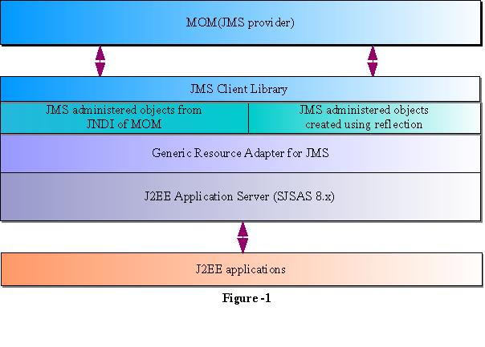

# User Guide to Generic Resource Adapter for JMS

:author: Binod P.G
:version: 0.9
:description: This document describes how to use Generic Resource Adapter for JMS.

## Introduction

J2EE Connectors 1.5 specification standardizes Resource Adapters as the default jms-provider-pluggability mechanism for a J2EE application server. Message Provider vendors, have not yet released Connector 1.5 compliant resource adapters to connect to their messaging products. 

Generic Resource Adapter for JMS is a J2EE Connector 1.5 resource adapter that can wrap the JMS client library of any JMS provider, like IBM Websphere MQ, Tibco EMS, Sonic MQ etc, and thus integrate any JMS provider with a J2EE 1.4  application server like Sun Java System Application Server. The adapter is a .rar archive that can be deployed and configured using a J2EE 1.4 application server's administration tools.  

## Acknowledgements

Following Individuals from Sun Microsystems have contributed significantly to inception and delivery of this project.

```
Binod P.G
Sivakumar Thyagarajan
George Tharakan
Sreeram Duvur
Rich Sharples
Murthy Narayanan
V Narayanan
Sanjeev Krishnan
Dianne Jiao
```

## Technical Architecture



As shown in Figure-1, Generic Resource Adapter wraps the JMS client library of the JMS provider. The Resource Adapter can be configured to use either reflection or JNDI lookup as the way to obtain JMS Administered Objects for its internal operation. These administered objects are used as the basic gateway to contact the JMS provider for both inbound and outbound communication. The Resource Adapter can be configured to indicate whether the JMS provider supports XA or not. Configuration details are described below . 

### Outbound communication

When a QueueConnectionFactory is created using the Generic Resource Adapter, it will use QueueConnectionFactory or XAQueueConnectionFactory implementation of the JMS provider, internally, to execute JMS and Transactional JMS operations. The resource adapter will create such an internal administered object either by reflection or by looking up JNDI provider of the JMS provider, depending upon its configuration settings. 

### Inbound Communication

For achieving inbound communication to message driven beans, Generic Resource Adapter depends on the JMS optional functionality called ConnectionConsumer /ServerSessionPool. It is expected that most of the JMS providers will implement ConnectionConsumer functionality as specified in chapter 8 of the JMS 1.1 specification, even though it is optional. Similar to outbound communication, resource adapter uses JMS administered objects to communicate with the JMS provider. For example, to receive messages from the JMS provider, resource adapter will create (or lookup) a ConnectionFactory implementation of the JMS provider and create a ConnectionConsumer.

## How to configure the Generic Resource Adapter for JMS?

A J2EE 1.4 application server's administration tools can be used to deploy and configure Generic Resource Adapter for JMS. This section explains how to configure Generic Resource Adapter for JMS with Sun Java System Application Server.  Overall the Resource Adapter can be configured to indicate whether JMS provider supports XA or not. It is also possible to indicate what mode of integration is possible with JMS provider. Two modes of integration is supported by the Resource Adapter. First one uses JNDI as the means of integration. In this case, administered objects are setup in JMS provider's JNDI tree and will be looked up for use by the Generic Resource Adapter resources. If that mode is not suitable for integration, it is also possible to use java reflection of JMS administered object javabean classes as the mode of integration. 

Users can use either the Sun Java System Application server's admin GUI or CLI to configure the resource adapter. This is not different from configuring any other resource adapter. More information about how to use a resource adapter with application server is available in the Adminsitratiion Guide and Developers Guide of the Application Server 8.1

Prior to deploying the resource adapter JMS client libraries should be made available to the application server. For some JMS providers, client libraries may also include native libraries. In such cases, these native libraries should also be made available to the application server JVM(s).

### CLI Commands.

Following steps could be used to deploy the resource adapter and configure the resources to work with SJSMQ. For some other JMS provider, though steps would remain the same, the information will change.

### Deploying the resource adapter:

```
asadmin create-resource-adapter-config --user admin --password adminadmin --property SupportsXA=true:ProviderIntegrationMode=javabean:ConnectionFactoryClassName=com.sun.messaging.ConnectionFactory:\
CommonSetterMethodName=setProperty:UserName=guest:Password=guest:\
QueueConnectionFactoryClassName=com.sun.messaging.QueueConnectionFactory:\
TopicConnectionFactoryClassName=com.sun.messaging.TopicConnectionFactory:\
QueueClassName=com.sun.messaging.Queue:TopicClassName=com.sun.messaging.Topic:\
LogLevel=info:UserName=guest:Password=guest:XAQueueConnectionFactoryClassName=com.sun.messaging.XAQueueConnectionFactory:\
XATopicConnectionFactoryClassName=com.sun.messaging.XATopicConnectionFactory:\
XAConnectionFactoryClassName=com.sun.messaging.XAConnectionFactory genericra
```

```
asadmin deploy --user admin --password adminadmin /tmp/genericra.rar
```

### Creating a ConnectionFactory

```
asadmin create-connector-connection-pool --raname genericra --connectiondefinition javax.jms.QueueConnectionFactory qcpool
```

```
asadmin create-connector-resource --poolname qcpool jms/QCFactory
```

### Creating a Destination

```
asadmin create-admin-object --raname genericra --restype javax.jms.Queue --property DestinationProperties=Name\\=clientQueue jms/clientQueue
```

### MDB deployment descriptor

Following is an example of a sun-ejb-jar.xml configured to use Generic Resource Adapter for JMS instead of default Sun Java System Message Queue.

```xml
<?xml version="1.0" encoding="UTF-8"?>

<!DOCTYPE sun-ejb-jar PUBLIC '-//Sun Microsystems, Inc.//DTD Application Server 8.1 EJB 2.1//EN' 'http://www.sun.com/software/sunone/appserver/dtds/sun-ejb-jar_2_1-1.dtd'>
<!-- Copyright 2002 Sun Microsystems, Inc. All rights reserved. -->
<sun-ejb-jar>

   <enterprise-beans>

   <unique-id>1</unique-id>

     <ejb>

     <ejb-name>SimpleMessageEJB</ejb-name>

     <jndi-name>jms/SampleQueue</jndi-name>

     <resource-ref>

       <res-ref-name>jms/QCFactory</res-ref-name>

       <!--

       jndi-name below should be the name of connector-resource created in step 1 of configuration section above

       -->

       <jndi-name>jms/QCFactory</jndi-name>

       <default-resource-principal>

       <name>guest</name>

       <password>guest</password>

       </default-resource-principal>

     </resource-ref>

     <resource-env-ref>

       <resource-env-ref-name>jms/clientQueue</resource-env-ref-name>

       <!--

       jndi-name below should be the name of admin-object-resource created in step 2 of section above

       -->

       <jndi-name>jms/clientQueue</jndi-name>

     </resource-env-ref>

     <mdb-resource-adapter>
       <!-- The resource adapter mid element ties the generic ra for JMS with this particular MDB -->
       <resource-adapter-mid>genericra</resource-adapter-mid>

       <activation-config>

        <activation-config-property>

          <activation-config-property-name>DestinationType</activation-config-property-name>

          <activation-config-property-value>javax.jms.Queue</activation-config-property-value>

        </activation-config-property>

        <activation-config-property>

          <activation-config-property-name>DestinationProperties</activation-config-property-name>

          <activation-config-property-value>imqDestinationName=Queue</activation-config-property-value>

       </activation-config-property>

       <activation-config-property>

         <activation-config-property-name>MaxPoolSize</activation-config-property-name>

         <activation-config-property-value>32</activation-config-property-value>

       </activation-config-property>

       <activation-config-property>

         <activation-config-property-name>RedeliveryAttempts</activation-config-property-name>

         <activation-config-property-value>0</activation-config-property-value>

       </activation-config-property>

       <activation-config-property>

         <activation-config-property-name>ReconnectAttempts</activation-config-property-name>

         <activation-config-property-value>4</activation-config-property-value>

       </activation-config-property>

       <activation-config-property>

         <activation-config-property-name>ReconnectInterval</activation-config-property-name>

         <activation-config-property-value>10</activation-config-property-value>

       </activation-config-property>

       <activation-config-property>

         <activation-config-property-name>RedeliveryInterval</activation-config-property-name>

         <activation-config-property-value>1</activation-config-property-value>

       </activation-config-property>

       <activation-config-property>

         <activation-config-property-name>SendBadMessagesToDMD</activation-config-property-name>

         <activation-config-property-value>true</activation-config-property-value>

       </activation-config-property>

       <activation-config-property>

         <activation-config-property-name>DeadMessageDestinationClassName</activation-config-property-name>

         <activation-config-property-value>com.sun.messaging.Queue</activation-config-property-value>

       </activation-config-property>

       <activation-config-property>

         <activation-config-property-name>DeadMessageDestinationProperties</activation-config-property-name>

         <activation-config-property-value>imqDestinationName=DMDtest</activation-config-property-value>

       </activation-config-property>

      </activation-config>

     </mdb-resource-adapter>

     </ejb>

   </enterprise-beans>

</sun-ejb-jar>
```

### Security policy changes

Following security policy changes are required in Sun Java System Application Server.

1. Modify <SJSAS_HOME>/domains/domain1/config/server.policy to add java.util.logging.LoggingPermission "control"
2. Modify <SJS_HOME>/lib/appclient/client.policy to add permission javax.security.auth.PrivateCredentialPermission
"javax.resource.spi.security.PasswordCredential * \"*\"","read";

### Configuration required to run Appclient

To run a client JMS application, either as a standalone java application or bundled as an appclient, make sure that the `genericra.jar` is part of the classpath. `genericra.jar` is available as part of generic ra distribution. It is also bundled in `.rar` archive.

All configuration requirements for JMS client library (including setting of classpath) should also be fullfilled prior to running the client applications. Since these configurations vary across JMS providers, it is not included in this document.

### Configuration Properties

#### Resource Adapter properties

These properties will be used in  create-resource-adapter-config command. 

[options="header"]
|===
|Property Name|Valid Values|Default Value|Description

|ProviderIntegrationMode
|javabean/jndi
|javabean
|Decides the mode of integration to be used between resource adapter and jms client.

|ConnectionFactoryClassName
|Name of the class available in appserver classpath (eg: com.sun.messaging.ConnectionFactory)
|NA
|Class Name of javax.jms.ConnectionFactory implementation of the jms client. Used if ProviderIntegrationMode is specified as "javabean"

|QueueConnectionFactoryClassName
|Name of the class available in appserver classpath (eg: com.sun.messaging.QueueConnectionFactory)
|NA
|Class Name of javax.jms.QueueConnectionFactory implementation of the jms client. Used if ProviderIntegrationMode is specified as "javabean"

|TopicConnectionFactoryClassName
|Name of the class available in appserver classpath (eg: com.sun.messaging.TopicConnectionFactory)
|NA
|Class Name of javax.jms.TopicConnectionFactory implementation of the jms client. Used if ProviderIntegrationMode is specified as "javabean"

|XAConnectionFactoryClassName
|Name of the class available in appserver classpath (eg: com.sun.messaging.XAConnectionFactory)
|NA
|Class Name of javax.jms.ConnectionFactory implementation of the jms client. Used if ProviderIntegrationMode is specified as "javabean"

|XAQueueConnectionFactoryClassName
|Name of the class available in appserver classpath (eg: com.sun.messaging.XAQueueConnectionFactory)
|NA
|Class Name of javax.jms.XAQueueConnectionFactory implementation of the jms client. Used if ProviderIntegrationMode is specified as "javabean"

|XATopicConnectionFactoryClassName
|Name of the class available in appserver classpath (eg: com.sun.messaging.XATopicConnectionFactory)
|NA
|Class Name of javax.jms.XATopicConnectionFactory implementation of the jms client. Used if ProviderIntegrationMode is specified as "javabean"

|TopicClassName
|Name of the class available in appserver classpath (eg: com.sun.messaging.Topic)
|NA
|Class Name of javax.jms.Topic implementation of the jms client. Used if ProviderIntegrationMode is specified as "javabean"

|QueueClassName
|Name of the class available in appserver classpath (eg: com.sun.messaging.Queue)
|NA
|Class Name of javax.jms.Queue implementation of the jms client. Used if ProviderIntegrationMode is specified as "javabean"

|SupportsXA
|True/false
|FALSE
|Specifies whether the jms client supports XA or not.

|ConnectionFactoryProperties
|Name value pairs separated by comma.
|NA
|This specifies the javabean propery names and values of the ConnectionFactory of jms client. Required only if ProviderIntegrationMode is "javabean"

|JndiProperties
|Name value pairs separated by comma.
|NA
|This specifies JNDI provider properties to be used for connecting to JMS provider's JNDI. Used only if ProviderIntegrationMode is "jndi"

|CommonSetterMethodName
|Method name.
|NA
|This specifies the common setter method name some JMS vendors use to set the properties on their administered objects. Used only if ProviderIntegrationMode is "javabean". In case of SJSMQ, this value is "setProperty"

|UserName
|Name of JMS user
|NA
|UserName to connect to JMS Provider.

|Password
|Password for JMS user.
|NA
|Password to connect to JMS provider.
|===

#### ManagedConnectionFactory Properties

ManagedConnectionFactory properties are specified when a connector-connection-pool is created. All the properties specified in resource adapter section can be overridden in a ManagedConnectionFactory. Additional properties available only in ManagedConnectionFactory are given below.

[options="header"]
|===
|Property Name|Valid Value.|Default Value.|Description

|ClientId
|A valid client ID
|NA
|ClientID as specified by jms 1.1 specification.

|ConnectionFactoryJndiName
|JNDI Name
|NA
|JNDI name of the connection factory bound in JNDI tree of JMS provider. Administrator should provide all connection factory properties (except clientID) in the JMS provider itself. This property name will be used only if ProviderIntegratinMode is "jndi".

|ConnectionValidationEnabled
|true/false
|FALSE
|If set to true, resource adapter will use an exception listener to catch any connection exception and will send a CONNECTION_ERROR_OCCURED event to application server.
|===


#### AdminObject Properties.

Properties in this section are specified when a connector-admin-object is created. All the properties specified in resource adapter section can be overridden in an AdminObject. Additional properties available only in AdminObject are given below.

[options="header"]
|===
|Property Name|Valid Values.|Default Value.|Description

|DestinationJndiName
|Jndi Name
|NA
|JNDI name of the destination bound in JNDI tree of JMS provider. Administrator should provide all properties in the JMS provider itself. This property name will be used only if ProviderIntegrationMode is "jndi".

|DestinationProperties
|Name value pairs separated by comma
|
|This specifies the javabean propery names and values of the Destination of jms client. Required only if ProviderIntegrationMode is "javabean"
|===

#### Activation Spec Properties

Properties in this section are specified in the sun specific deployment descriptor of MDB as activation-config-properties. All the properties specified in resource adapter section can be overridden in an ActivationSpec. Additional properties available only in ActivationSpec are given below.

[options="header"]
|===
Property Name|Valid Values.|Default Value.|Description

|MaxPoolSize
|An integer
|8
|Maximum size of server session pool internally created by resource adapter for achieving concurrent message delivery. This should be equal to maximum pool size of MDB objects.

|MaxWaitTime
|An integer
|3
|Resource Adapter will wait for the time in seconds specified by this property to obtain a server session from its internal pool. If this limit is exceeded message delivery will fail.

|SubscriptionDurability
|"Durable" or "Non-Durable"
|"Non-Durable"
|SubscriptionDurability as specified by jms 1.1 specification.

|SubscriptionName
|
|NA
|SubscriptionName as specified by jms 1.1 specification.

|MessageSelector
|A valid message selector
|NA
|MessageSelector as specified by jms 1.1 specification.

|ClientID
|A valid client ID
|NA
|ClientID as specified by jms 1.1 specification.

|ConnectionFactoryJndiName
|A valid Jndi Name
|NA
|JNDI name of connection factory created in JMS provider. This connection factory will be used by resource adapter to create a connection to receive messages. Used only if ProviderIntegrationMode is configured as "jndi"

|DestinationJndiName
|A valid Jndi Name
|NA
|JNDI name of destination created in JMS provider. This destination will be used by resource adapter to create a connection to receive messages from. Used only if ProviderIntegrationMode is configured as "jndi"

|DestinationType
|"javax.jms.Queue" or "javax.jms.Topic"
|null (hmmm... It should be javax.jms.Queue)
|Type of the destination the MDB will listen to.

|DestinationProperties
|Name Value Pairs separated by comma
|NA
|This specifies the javabean propery names and values of the Destination of jms client. Required only if ProviderIntegrationMode is "javabean"

|RedeliveryAttempts
|integer
|
|Number of times a message will be redelivered in case a message cause a runtime exception in the MDB.

|RedeliveryInterval
|time in seconds
|
|interval between redeliveries, in case a message cause a runtime exception in the MDB.

|SendBadMessagesToDMD
|true/false
|false.
|Indicates whether RA should send the messages to a dead message destination, if redelivery attempts is exceeded.

|DeadMessageDestinationJndiName
|a valid JNDI name.
|NA
|JNDI name of destination created in JMS provider. Target destination for dead messages. Used only if ProviderIntegrationMode is configured as "jndi"

|DeadMessageDestinationClassName
|class name of destination object.
|NA
|Used if ProviderIntegrationMode is specified as "javabean"

|DeadMessageDestinationProperties
|Name Value Pairs separated by comma
|NA
|This specifies the javabean propery names and values of the Destination of jms client. Required only if ProviderIntegrationMode is "javabean"

|ReconnectAttempts
|integer
|
|Number of times a reconnect will be attempted in case exception listener catches an error on connection.

|ReconnectInterval
|time in seconds
|
|interval between reconnects.
|===

## Full feature list

Following are the list of features implemented in the Generic Resource Adapter for JMS. More details will be given in the next version of the document.

[options="header"]
|===
|Feature Name|Description|Comments/Caveats

|Connection Pooling
|The resource adapter supports connection pooling as specified by the connector specification
|

|Distributed Transactions
|Supports XA for both inbound and outbound communication.
|Depends on the XA support of the JMS provider and its client library.

|Concurrent Message Delivery
|Concurrent Message delivery for both topics and Queues.
|Batched Message delivery is not supported.

|Connection Exception Handling
|A CONNECTION_ERROR_OCCURED event will be sent to the application server, when a fatal error occur on a physical connection. The connection will subsequently be removed from the connection pool.
|This is an availability feature and its implementation depends on ExceptionListener support of the JMS provider.
*Not yet tested successfully*

|Dead Message Destination
|After redelivering, as many times as specified in the activation-spec property RedeliveryAttempts, a poisonous message, that results in throwing of a  runtime exception in a transacted MDB, will be moved to this destination
|RedeliveryAttempts and RedeliveryInterval can also be configured.

|Reconnect for inbound connections.
|Inbound connections will be destroyed and reconnected, if the connection that receives the messages fails
|*Not yet tested successfully* and depends on ExceptionListener support of the JMS provider.
|===
## List of Issues

- Connection Pooling cannot be used for outbound connections that use ClientID.
- Load balancing of inbound messages to appserver instances of a cluster is not supported by the resource adapter. However, if a JMS provider support load balancing, resource adapter should be able to make use of that.
- If the JMS client library does not support ConnectionConsumer, then inbound communication will not work.

## How to checkout source and build the resource adapter

https://github.com/eclipse-ee4j/genericjmsra gives information about how to checkout the source code of the Generic Resource Adapter for JMS. See the instructions on README.build file on the tip of cvs tree to learn about building Generic Resource Adapter for JMS.

## Feedback

Please use https://github.com/eclipse-ee4j/genericjmsra/issues to report an issue or ask questions.

## More Information
Developing connectors with Sun Java System Application Server

Sun Java System Application Server documentation 