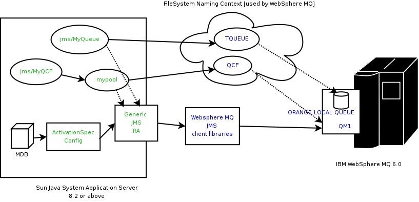

# Integrating Sun Java System Application Server with IBM Websphere MQ 6.0 using Generic Resource Adapter for JMS

:author: By Sushmita Sharma and Sivakumar Thyagarajan
:created-on: February 2006

It has often been an enterprise application integration [EAI] developer's nightmare to integrate disparate messaging products with transactional applications deployed in a Java EE application server. The preferred message provider pluggability mechanism in J2EE 1.4 and beyond is using the http://java.sun.com/j2ee/connector/[Connectors 1.5 architecture] but a lot of messaging providers do not bundle Connectors 1.5 compliant resource adapters to help in this integration.

The https://github.com/eclipse-ee4j/genericjmsra[Generic resource adapter for JMS] project helps in integrating messaging products with J2EE application servers by wrapping their JMS client library in a J2EE Connector Architecture 1.5 resource adapter. It has been used to integrate different messaging products like Tibco EMS and Sun Java System Message Queue with the Sun Java System Application Server.  In this article we would guide you through the steps for using the Generic Resource Adapter for JMS [referred to as 'Generic RA' in the article going forward] to integrate IBM 
http://www.ibm.com/software/integration/wmq/v60/[WebSphere MQ 6.0] [formerly MQ Series] with http://www.sun.com/software/products/appsrvr_pe/index.xml[Sun Java System Application Server 8.2.]

Instructions outlined in this article could also be used to integration WebSphere MQ 6.0 with https://javaee.github.io/glassfish/[Project GlassFish] and the http://java.sun.com/javaee/downloads/[Java EE 5 SDK preview/Sun Java System Application Server PE 9 beta] versions available today.

## Article Conventions/Assumptions

Through out this article, we have used the asadmin command line interface to show all the interactions performed with the application server.  You could also use the asadmin GUI console to achieve the same. Similarly this article assumes a *nix based system [Solaris, Linux].  If you are using Windows,  Replace the instructions with Windows equivalents as necessary. 

Similarly the steps outlined below assume a successful installation of IBM Websphere MQ 6.0. Please refer the WebSphere MQ documentation for installation details. 
This article also assumes that the Websphere MQ broker and the application server are deployed and running on the same physical host/machine. If you have the MQ broker running on a different machine and need to access it remotely, please refer the WebSphere MQ documentation for configuration details. The RA configuration and other application server related configuration remains unchanged.  

While looking at the configuration of the resource-adapter, connector connection pool etc. in this article, only a handful of properties, relevant for this discussion is covered. Please note that all the resource adapter, connection factory and activationspec configuration, listed in the Generic RA https://github.com/eclipse-ee4j/genericjmsra/tree/master/docs/userguide[user guide] could be used while configuring these objects.

## Initial Setup 

The following permissions need to be added to the server.policy and the client.policy file to deploy the generic resource adapter and to run the client application.

- Edit the server.policy file in the [${appserver-install-dir}/domains/domain1/config/] directory using your favourite text editor and add the following line to the default grant block.


    permission java.util.logging.LoggingPermission "control";
    permission java.util.PropertyPermission "*", "read,write";               


- Should you use an application client in your application, edit the application client's client.policy file in the [${appserver-install-dir}/lib/appclient/client.policy] directory and add the following line to it.

    permission javax.security.auth.PrivateCredentialPermission "javax.resource.spi.security.PasswordCredential * \"*\"","read";
    
- Modify the domain's classpath to add IBM MQ 6.0 jars located in IBM MQ installation lib directory. The asadmin GUI could be used to modify a domain's classpath. Open a browser and type the url of the application server admin GUI - http://hostname:adminport. Go to Application Server -> JVM Settings -> Path Settings . Add an entry for the jar files shown below [comma-separated as shown below] in the classpath suffix. Restart the application server domain for these changes to take effect.     

    /opt/mqm/java/lib/com.ibm.mq.jar,
    /opt/mqm/java/lib/com.ibm.mq.jms.Nojndi.jar,
    /opt/mqm/java/lib/com.ibm.mq.soap.jar,
    /opt/mqm/java/lib/com.ibm.mqjms.jar,
    /opt/mqm/java/lib/com.ibm.mqetclient.jar,
    /opt/mqm/java/lib/commonservices.jar,
    /opt/mqm/java/lib/dhbcore.jar,
    /opt/mqm/java/lib/rmm.jar,
    /opt/mqm/java/lib/providerutil.jar,
    /opt/mqm/java/lib/CL3Export.jar,
    /opt/mqm/java/lib/CL3Nonexport.jar

- Set the LD_LIBRARY_PATH environment variable to /opt/mqm/java/lib and restart the application server.  For example in *NIX system, based on the choice of your shell. you would type in 

    $ export LD_LIBRARY_PATH=/opt/mqm/java/lib

## Configuring IBM Websphere MQ administered objects using Websphere MQ's administration console



- Note: All artifacts created on the WebSphere MQ side and the application server side are shown in blue and green respectively in the image above.

- Before we start working on Websphere MQ, if the installation has created a user and a group called mqm, specify a password for the mqm user via 

    $ passwd mqm

- Switch user to mqm

    $ su mqm

- For Linux, a different kernel version needs to be set $ export LD_ASSUME_KERNEL=2.2.5

- Create a mq queue manager called say 'QM1' using the `crtmqm` command.

    $ crtmqm QM1       

- Start the mq queue manager we have just created. In the image above, see QM1 associated with the IBM WebSphere MQ broker.

    $ strmqm QM1

- Start the MQ listener using the `runmqlsr` command

    $ runmqlsr -t tcp -m QM1 -p 1414 &

- Now, some configuration changes needs to be done to get the JMSAdmin working. Change to the /opt/mqm/java/bin directory and edit the JMSAdmin script to change the jvm to a location of a valid jvm in your system. 

- Set the relevant environment variable required for JMSAdmin by sourcing the setjmsenv script located in /opt/mqm/java/bin folder.

    $ cd /opt/mqm/java/bin
    $ source setjmsenv

- Change the JMSAdmin.config file to indicate the Initial Context Factory we would using. To simplify things, let's use the Sun's File System Context Provider. The PROVIDER_URL is used to specify the directory where the JNDI binding information would be stored. It should point to an appropriate directory that has write permissions. Edit the JMSAdmin.config file to set the following name-value pairs and comment out the rest.

    INITIAL_CONTEXT_FACTORY=com.sun.jndi.fscontext.RefFSContextFactory
    PROVIDER_URL=file:/opt/tmp
 
- Create Websphere MQ queues using the `runmqsc` console and `MQJMS_PSQ.mqsc` script.

    $ runmqsc QM1 < MQJMS_PSQ.mqsc

- Create user defined physical queue for your application using runmqsc console and an appropriate physical queue name. An example of how this could be done is shown below. In the image above, see ORANGE.LOCAL.QUEUE associated with QM1.

    $ runmqsc QM1
        > DEFINE QLOCAL(ORANGE.LOCAL.QUEUE)
        > end

- Start the Webspere MQ broker

    $ strmqbrk -m QM1

- In the WebSphere MQ JMSAdmin console use the following commands to create the connection factories, XA connection factories and the queues and topics for your application. A sample listing for creating each of the various JMS administered objects is shown below. In the image above, see QCF [for QM1] and TQueue [associated with ORANGE.LOCAL.QUEUE] defined in the FileSystem Naming Context.

    $ ./JMSAdmin

        InitCtx>def qcf<JNDI Name to be given to the Queue Connection Factory> hostname<IBM MQ server hostname> port(1414) channel(SYSTEM.DEF.SVRCONN)      
                      transport(CLIENT) qmanager<name of queue manager defined >
                     e.g. def qcf(QCF) hostname(localhost) port(1414) channel(SYSTEM.DEF.SVRCONN) transport(CLIENT) qmanager(QM1)

        InitCtx>def xaqcf<JNDI Name to be given to the XA Queue Connection Factory> hostname<IBM MQ server hostname> port(1414) channel(SYSTEM.DEF.SVRCONN)
                     transport(CLIENT) qmanager<name of queue manager defined >
                     e.g. def xaqcf(XAQCF) hostname(localhost) port(1414) channel(SYSTEM.DEF.SVRCONN) transport(CLIENT) qmanager(QM1)

        InitCtx>def q<JNDI Name to be given to the Queue> queue<physical queue name> qmanager(name of queue manager defined )
                     e.g. def q(TQueue) queue(ORANGE.LOCAL.QUEUE) qmanager(QM1)

        InitCtx>def tcf<JNDI Name to be given to the  Topic Connection Factory> qmanager(name of queue manager defined )
                    e.g. def tcf(TCF) qmanager(QM1)

        InitCtx>def xatcf<JNDI Name to be given to the  XA Topic Connection Factory> qmanager(name of queue manager defined )
                    e.g. def xatcf(XATCF) qmanager(QM1)

        InitCtx>def t<JNDI Name to be given to the Topic> topic<sample topic name >
                    e.g. def t(TTopic) topic(topic)
     
## Configuring the Resource Adapter

- Add ${appserver-install-dir}/bin to your PATH. The asadmin CLI command can be found at ${appserver-install-dir}/bin. In SJSAS, a resource adapter configuration is used to specify the configuration of a resource adapter. Use the following command to create a resource adapter configuration for genericra, to configure it to work with IBM WebSphere MQ. 

    asadmin create-resource-adapter-config --user <adminname> --password <admin password> --property SupportsXA=true:ProviderIntegrationMode=jndi:UserName=mqm:Password=###:RMPolicy=OnePerPhysicalConnection:
    JndiProperties=java.naming.factory.url.pkgs\\=com.ibm.mq.jms.naming,java.naming.factory.initial\\=com.sun.jndi.fscontext.RefFSContextFactory,java.naming.provider.url\\=
    file\\:\\/\\/opt\\/tmp:LogLevel=finest genericra

A brief description of the various properties used in the above command is explained below:

*SupportsXA* 
Set the supports distributed transactions attribute to true. The level of transactional support the adapter provides -- none, local, or XA -- depends on the capabilities of the Enterprise Information System [EIS] being adapted. If an adapter supports XA transactions and this attribute is XA, the application can use distributed transactions to coordinate the EIS resource with JDBC and JMS resources.

*ProviderIntegrationMode*
Set the integration mode as JNDI. Two integration modes exist in the Generic Resource Adapter for JMS. The JNDI mode allows the resource adapter to use the administered objects published in the message provider's JNDI provider to integrate with the message provider.

*Username and Password*
Message provider specific user credentials. [In this case, modify this attribute to reflect the IBM MQ username/password]

*JndiProperties*
This property [comma-separated list of name-value pairs] specifies JNDI provider properties to be used for connecting to the JMS provider's JNDI. In our case, we set it to the JNDI configuration specified earlier.

*RMPolicy*
Some XAResource implementations such as IBM MQ Series, relies on a Resource Manager per Physical Connection and this causes issues when there is inbound and outbound communication to the same queue manager in a single transaction (For example, an MDB sends  a response to a destination). When RMPolicy is set to OnePerPhysicalConnection, the XAResource wrapper implementation's isSameRM in Generic JMS RA would check if both the XAResources use the same physical connection, before delegating to the wrapped objects. Ensure that this attribute is set to "OnePerPhysicalConnection" if the application uses XA. Additional information on this attribute is available in the resources section below.

## Deploying the Resource adapter

- Download the Generic RA bits from the project site. With Sun Java System Application Server 8.2 Platform Edition, Generic RA is available out-of-the-box with the application server and you could choose to use the bundle resource adapter as well in the step below.

- Deploy the resource adapter using the asadmin deploy command, as shown below. In the image above, see Generic JMS RA deployed in the application server.

    $ asadmin deploy --user admin --password adminadmin <location of the generic resource adapter rar file>
       
## Creating Connection Factories and Administered Objects in SJSAS

In order to configure a JMS Connection Factory, using the Generic Resource Adapter for JMS, a Connector connection pool and resource needs to be created in the application server, as shown below. In the image above, see mypool [pointing to Generic JMS RA and QCF] and jms/MyQCF [for mypool] created in the application server.

### Connector connection pool creation

- Creates a Connection Pool called mypool and points to XAQCF created in IBM MQ

    asadmin create-connector-connection-pool -- raname genericra connectiondefinition javax.jms.QueueConnectionFactory --transactionsupport  XATransaction --property ConnectionFactoryJndiName=QCF mypool

- Creates a Connection Pool called mypool2 and points to XATCF created in IBM MQ

    asadmin create-connector-connection-pool -- raname genericra connectiondefinition javax.jms.TopicConnectionFactory --transactionsupport  XATransaction --property ConnectionFactoryJndiName=XATCF mypool2

### Connector resource creation

- Creates a connector resource named jms/MyQCF and binds this resource to JNDI for applications to use.

    asadmin create-connector-resource --poolname mypool jms/MyQCF

- Creates a connector resource named jms/MyTCF and binds this resource to JNDI for applications to use.

    asadmin create-connector-resource --poolname mypool2 jms/MyTCF

### Admin Objects

For JMS Destination Resources, an administered object needs to be created. In the image above, see jms/MyQueue [pointing to Generic JMS RA and TQueue] created in the application server.

- Creates a javax.jms.Queue Administered Object and binds it to application server's JNDI tree at jms/MyQueue and points to jms/TQueue created in IBM MQ.

    asadmin create-admin-object --raname genericra --restype javax.jms.Queue --property DestinationJndiName=TQueue jms/MyQueue

- Creates a javax.jms.Topic Administered Object and binds it to application server's JNDI tree at jms/MyTopic and points to jms/TTopic created in IBM MQ.

    asadmin create-admin-object --raname genericra --restype javax.jms.Topic --property DestinationJndiName=TTopic jms/MyTopic

## Component Deployment descriptors

The sample deployment descriptor below assumes the application described in the Tibco EMS integration how to guide available in the genericjmsra java.net communite page.

The deployment descriptors need to take into account the resource adapter and the connection resources that have been created. A sample sun-ejb-jar.xml for a Message Driven Bean that listens to a destination called TQueue in WebSphere MQ, and publishes back reply messages to a destination resource named jms/replyQueue  is shown below.

```xml
<?xml version="1.0" encoding="UTF-8"?>
<!DOCTYPE sun-ejb-jar PUBLIC '-//Sun Microsystems, Inc.//DTD Sun ONE Application Server 7.0 EJB 2.0//EN' 'http://www.sun.com/software/sunone/appserver/dtds/sun-ejb-jar_2_0-0.dtd'>
<!-- Copyright 2002 Sun Microsystems, Inc. All rights reserved. -->
<sun-ejb-jar>
    <enterprise-beans>
    <unique-id>1</unique-id>
   <ejb>
            <ejb-name>SimpleMessageEJB</ejb-name>
            <jndi-name>jms/SampleQueue</jndi-name>
             <!-- QCF used to publish reply messages -->
            <resource-ref>
                    <res-ref-name>jms/MyQueueConnectionFactory</res-ref-name>
                    <jndi-name>jms/MyQCF</jndi-name>
                    <default-resource-principal>
                            <name>mqm</name>
                            <password>mqm</password>
                    </default-resource-principal>
            </resource-ref>
            <!-- reply destination resource. Creating of this replyQueue destination resource is not
                   shown above, but the steps are similar to creating the  "jms/MyQueue" resource -->
            <resource-env-ref>
                    <resource-env-ref-name>jms/replyQueue</resource-env-ref-name>
                    <jndi-name>jms/replyQueue</jndi-name>
            </resource-env-ref>

             <!-- Activation related RA specific configuration for this MDB -->
            <mdb-resource-adapter>
            <!-- resource-adapter-mid points to the Generic Resource Adapter for JMS -->
            <resource-adapter-mid>genericra</resource-adapter-mid>
            <activation-config>
                    <activation-config-property>
                            <activation-config-property-name>DestinationType</activation-config-property-name>
                            <activation-config-property-value>javax.jms.Queue</activation-config-property-value>
                    </activation-config-property>
                    <activation-config-property>
                            <activation-config-property-name>ConnectionFactoryJndiName</activation-config-property-name>
                            <activation-config-property-value>QCF</activation-config-property-value>
                    </activation-config-property>
                <activation-config-property>
                            <activation-config-property-name>DestinationJndiName</activation-config-property-name>
                            <activation-config-property-value>TQueue</activation-config-property-value>
                    </activation-config-property>
                    <activation-config-property>
                            <activation-config-property-name>MaxPoolSize</activation-config-property-name>
                            <activation-config-property-value>32</activation-config-property-value>
                    </activation-config-property>
                    <activation-config-property>
                            <activation-config-property-name>RedeliveryAttempts</activation-config-property-name>
                            <activation-config-property-value>0</activation-config-property-value>
                    </activation-config-property>
                    <activation-config-property>
                            <activation-config-property-name>ReconnectAttempts</activation-config-property-name>
                            <activation-config-property-value>4</activation-config-property-value>
                    </activation-config-property>
                    <activation-config-property>
                            <activation-config-property-name>ReconnectInterval</activation-config-property-name>
                            <activation-config-property-value>10</activation-config-property-value>
                    </activation-config-property>
                    <activation-config-property>
                            <activation-config-property-name>RedeliveryInterval</activation-config-property-name>
                            <activation-config-property-value>1</activation-config-property-value>
                    </activation-config-property>
                    <activation-config-property>
                            <activation-config-property-name>SendBadMessagesToDMD</activation-config-property-name>
                            <activation-config-property-value>false</activation-config-property-value> 
                    </activation-config-property>
            </activation-config>
   </mdb-resource-adapter>
   </ejb>
   </enterprise-beans>
</sun-ejb-jar>
```

The business logic encoded in Message Driven Bean could then lookup the configured QueueConnectionFactory/Destination resource 
to create a connection as shown below.

```java
Context context = null;
ConnectionFactory connectionFactory = null;
logger.info("In PublisherBean.ejbCreate()");
try {
    context = new InitialContext();
    queue = (javax.jms.Queue) context.lookup ("java:comp/env/jms/replyQueue");
    connectionFactory = (ConnectionFactory) context.lookup("java:comp/env/jms/MyQueueConnectionFactory");
    connection = connectionFactory.createConnection();
} catch (Throwable t) {
    logger.severe("PublisherBean.ejbCreate:" + "Exception: " +
    t.toString());
}
```

## Resources

- Generic Resource Adapter for JMS community page - download/documentation
* Community Page https://github.com/eclipse-ee4j/genericjmsra
* Please use the user/dev mailing lists at the project site for all your queries.
- Generic Resource Adapter for JMS user guide
 https://github.com/eclipse-ee4j/genericjmsra/tree/master/docs/userguide
- Sun Java System Application Server 8.2 Platform Edition
* Features, data sheet at http://www.sun.com/software/products/appsrvr_pe/index.xml
* Download for free from Sun at http://java.sun.com/j2ee/1.4/download.html
- Java EE 5 SDK preview/Sun Java System Application Server PE 9 beta
- Developing Connectors chapter on Sun Java System Application Server Platform Edition 8.2 Developer's Guide
* http://docs.sun.com/app/docs/doc/819-4721/6n6rrfqlq?a=view
- Project GlassFish
https://javaee.github.io/glassfish/
- WebSphere MQ Version 6.0
* http://www.ibm.com/software/integration/wmq/v60/
* http://www.ibm.com/software/integration/wmq/library/
- For additional information on the 'RMPolicy' resource adapter configuration attribute refer issue#5 in the Generic RA issue tracker page. For documentation on usage of this attribute refer the Generic Resource Adapter for JMS user guide.
* https://github.com/eclipse-ee4j/genericjmsra/issues/5

Thanks to Binod PG for reviewing this documentation and providing feedback.